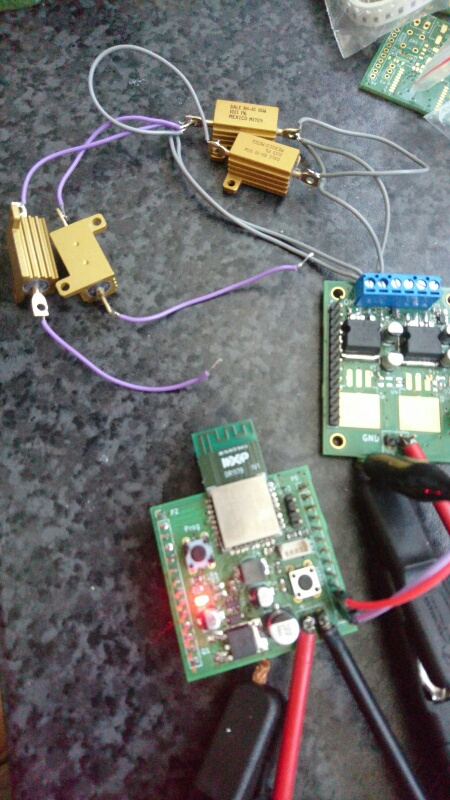

# JN5168DriverBoard
Companion to JN5168 Carrier Board. Provides four nMOS FETs with FET drivers for boosting control voltage.

To be used for connecting LED strips or plain voltage driven LEDs. The chosen MOSFETs are rated up to 16A and give plenty of headroom. While being logic level FETs, space for FET driver ICs is provided. So one may choose another FET (non-logic-level) in conjunction with the driver ICs. Or omit the driver ICs and go for the logic level FET.

# Board Pictures

.JPG)

.JPG)

Prototype boards shown here made by www.aisler.net (not affiliated in any way).

# Load Testing 

Load testing was performed using 10W resistors:

# See also:

http://www.boriswerner.eu/tinkering-tuesday-hueify-pwm-to-rgb-led-strip-driver-board

https://peeveeone.com/?page_id=252
